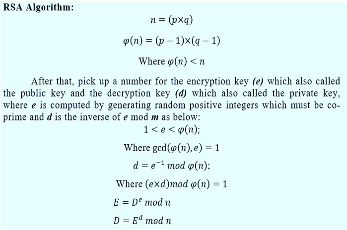

https://datatracker.ietf.org/doc/html/rfc7517 -> documentation


```json
{
  "alg": "RS256",
  "d": "De600ZWQT5Ao-wC5gMiIFijzN1kFvKLC2WPN4DhVZK8qxH-y-0wzfUgsSZVQ7Joywi1aD7EVB3Ly7fQGz2H2-khBhZq_JwZIVy4p1Uu2kd1JKRl1Qm8MqN9wmAkVHepSO4NqiYQa8jYxJxSA0VHPZtMr8kDEpPzfTfMuqpTa6lPTP2xvZfNKVuyE-u4XMjV8OJYDqsUgiGR4f9tV-Lw0KWsQTBrSPVDzC7xQ2vu3sFQ7NPw3kEE_r8w83GXGT5jB_FMYqHsc6YE0Eq8GpGRnwVoB2btIl8MAW1eE4dGwdMGFWLakMBE2DxXEOxrnPXoYoQMUeVpqx3DSI_lSQFKMQ7gmHu30dL_biwE-3mRaZx84hcOUFRgBXmeIn3ZmP9DhBOcuFkoexaIlwupgfXJRiUPOvIDDkidS-qc1emhD4KHeIotOgCuU5MsCZ6BeUI2OyHfPT6eukPt95I7iax73xYvN_wQwMLtMWmolac1eRUcWYCEAU26YmD-tNuXI6d2_",
  "dp": "BX3NRZJPOYZRgPAEcBbX7dZkfM2ospoOblEEAqT6_RJsXUN_F-qd0vOqQ3wAbXc3nHTFTo6XBWAcz3oPqZg95YHaTL4rYDKGR3XV5xXF6Lrof2CBVGRq55CX27uDlcAocCpVhyhmW2CQEyiOF4AFg6xELYE6dtClKMuji7pVkRRbDoQxmwfZj87wZkSG22Yozjk0MH0kollX07cf1J3CwhKluam7131QRNyiBrgUIgylr-Fj4Xj_b-ySfIsz7SD3",
  "dq": "RI82g-ZYrDh43oSgOT2y9TsCYE6Ikh-sca1RkoUqKi0KFtVisOZh_gZVoVrsFiI6QpKeC4mXAYZCqa-WCzOBk0U3gvuiX8u45eTJe81SR--FTmvAWOy4P94lzktQrgnCmwBvPi8piSi4-55DHxu3rO1VTYXvVMuwg5s44ToquE29qrLYxKPG-iTi8xJBQWwkkPwNruALBQ6aYB2bZ5AwfbuGOmKjV2wH3nfJPXKuDhtnXgkbye17GDSKOv_uqRXf",
  "e": "AQAB",
  "key_ops": [
    "sign"
  ],
  "kty": "RSA",
  "n": "0ckM7WgwD44ppuAQFjwaY_2cUrXdzq6YwYutEdz7NR124OJL35pLFB_4kyLg-Ce4-K8NgEInBtnSHf5086omEailRFTbudtv_CXR6ib81BW0cW9kAvWBtz_fgJV2Xl4sodfUxAPouinIBb5pzQrz81RM5gP-Vrnv363tk5KSOq8SkkI3msINt4eJoNawSp6ndJ47ZGrjTG6-4TMhjyQT-bhJHoDjRq3xRvvUURVNQjGOJLoCysoIPLHIdJy6w90puaWJGiDDGXWq9XYN5C5TqooRVr8fgiN5Mn5-_t6dkfaM5PoTCsY0UntuVl87bsHTOVL03LC0JnxQJ9bz-Gh404A_cv5hT69VG0_KLORpCs6LeGaOQae3XzFbqpFQCxvZvFGC2OG4htcJ0agPwjFAWJjuFgU9pI7wJXLHx65IEeLWTR2B5zfkQAh8KB6AJNhKwFC3Y-QLUb48P7i6nskbxM13GFBc_ych5DXnisYYqBXOTTfDvmT94cCgprGWumWt",
  "p": "9Kg_PQMY24xGLdxjkH6yrLHqoNSUUe0JSd3yXc0edu9eccrO_rs2ZYucTlw4pDlFCJgP5NVJ9Q8sTnc8VDbnxBbwRE1KYAxD3psgAggtrwsteMc2-d1rX83HUo49IYsVdk03bXP-kaZz2zcJlNEDmfrAyWzDnmMxgGZjyKMeWnuV_iEWUKfehsmQe2AWQ1pbm2lcW2yd7pfJMLhk5Jsgg8_upqC3_WqjnrMPBydOKY4jPwND2St9_CxGgLqksPiL",
  "q": "24Lr1zBYese-89McM3OgiQxW1o02OY8YsVE4xBbrvk4FLRrrx7uzEFNKWTrWTaVH_HWFVgd19vxptMNAYcWadIXBsawYzmMWPqE0LEJC-gglGB0ZqOQ8vW6EjT1oXEeyUVtQidqmxMJH98lBPVsfCYe8_-2M_1MsbXSbMGBmr6AF6J5trW_-LEwN9PvwfNWjvVJqRMiU1_x9s5Vvz-tKIFeyVQgQPAY-lwB1h08mF8GI7dVsyKx0lWz5-n_Drimn",
  "qi": "QFEmy-C4dMs3mNGG8QgwaloNyh9L55zKJLGU6PADwAaegQ2l87qxJYEfXkR0fRPOhsIhinP2ge-9_A5fs4PdqvnmWlPH9qrBSTtdox8-UeDOZo7h4DeI-epNPbEbsNRU862B8RU5TWia1IAM7QbfjaKQrPh3YtmWSGXKxa3xXdKpElbhyiab60PVnXkHbvP25PdRInnH_PlgmVo8Kvi7AxF7ctzrMQ2QfLpEYCQIfsuF15XU4vvqUwq-APDqJoNv",
  "use": "sig",
  "kid": "c02ff4b575f7ba86f67e4cd22de34edf"
}

```

---

Here is a brief explanation of these parameters:

n (modulus): Part of the public and private keys, used for both encryption and signature verification.

e (public exponent): Part of the public key, used for encryption.

d (private exponent): The private key parameter used for decryption and signing.

p and q: Prime factors of n used to derive d and perform certain operations.

dp, dq, and qi: These are additional parameters that can be part of the private key and help improve performance in certain cryptographic operations.

To perform cryptographic operations like signing JWTs or decrypting data, you will need the full set of private key parameters, including d, p, q, and potentially dp, dq, and qi. You can use these private key parameters with a suitable cryptographic library or tool to perform these operations securely.

---


To calculate the public key from a JSON Web Key (JWK), you can follow these steps. The process may vary slightly depending on the type of JWK (RSA, ECDSA, or HMAC) and the specific libraries or tools you're using, but I'll provide a general outline:

1. Determine the JWK Type:

    Before you begin, identify the type of JWK you have (e.g., RSA, ECDSA, HMAC). This will determine the specific steps you need to follow.


2. Extract the Parameters:

    In a JWK, there are specific parameters based on the key type. For example, for an RSA key, you'll have "n" (modulus) and "e" (exponent). For an ECDSA key, you'll have "x" and "y" coordinates.


3. Convert Parameters to the Public Key Format:

    Depending on the key type, you will need to convert the extracted parameters into the appropriate format for the public key.

    - For RSA:

        You need to combine the "n" (modulus) and "e" (exponent) into an RSA public key in PEM format or other suitable formats like DER or SSH.

    - For ECDSA:
        You need to create a public key by concatenating the "x" and "y" coordinates and adding a prefix indicating the key type (e.g., 0x04 for uncompressed keys). The resulting value represents the public key.


4. Encode the Public Key:

    Depending on your use case, you may need to encode the public key in a specific encoding, such as Base64.


5. Verify the Key:

    It's important to validate that the extracted parameters and key conversion were done correctly. You can use libraries or tools that support JWK parsing to validate the public key.


---

#### Example how to calculate Public key from a JWK

```kotlin
import org.bouncycastle.asn1.ASN1InputStream
import org.bouncycastle.asn1.DERBitString
import org.bouncycastle.asn1.DEROctetString
import org.bouncycastle.asn1.x509.RSAPublicKey
import org.bouncycastle.util.io.pem.PemObject
import org.bouncycastle.util.io.pem.PemWriter
import java.io.StringWriter
import java.math.BigInteger
import java.util.Base64

fun jwkToRsaPublicKey(jwk: Map<String, String>): String {
    val modulusBase64 = jwk["n"]
    val exponentBase64 = jwk["e"]

    val modulusBytes = Base64.getUrlDecoder().decode(modulusBase64)
    val exponentBytes = Base64.getUrlDecoder().decode(exponentBase64)

    val modulus = BigInteger(1, modulusBytes)
    val exponent = BigInteger(1, exponentBytes)

    val publicKey = RSAPublicKey(modulus, exponent)

    val writer = StringWriter()
    val pemWriter = PemWriter(writer)
    pemWriter.writeObject(PemObject("PUBLIC KEY", publicKey.getEncoded()))
    pemWriter.close()

    return writer.toString()
}

fun main() {
    val jwk = mapOf(
        "kty" to "RSA",
        "n" to "your_modulus",
        "e" to "your_exponent"
    )

    val publicKeyPem = jwkToRsaPublicKey(jwk)
    println(publicKeyPem)
}

```

---

#### Now regarding Private Keys

Calculating a private key from a JSON Web Key (JWK) is typically not possible, as private keys are meant to be kept secret and should not be derived from public keys or other information.


If you have a JWK with a public key, you can use that JWK for verifying signatures or encrypting data, but you cannot calculate the corresponding private key from it. Private keys are generated independently and must be securely stored.

If you need a private key, it should be generated using a cryptographic library in a secure and controlled manner.

```kotlin
import org.bouncycastle.asn1.x9.X9ECParameters
import org.bouncycastle.crypto.AsymmetricCipherKeyPair
import org.bouncycastle.crypto.KeyGenerationParameters
import org.bouncycastle.crypto.generators.ECKeyPairGenerator
import org.bouncycastle.crypto.params.ECDomainParameters
import org.bouncycastle.crypto.params.ECKeyGenerationParameters
import org.bouncycastle.jce.ECNamedCurveTable
import org.bouncycastle.jce.provider.BouncyCastleProvider
import java.security.KeyPair
import java.security.KeyPairGenerator
import java.security.Security

fun generateRsaPrivateKey(): KeyPair {
    Security.addProvider(BouncyCastleProvider())
    val keyPairGenerator = KeyPairGenerator.getInstance("RSA", "BC")
    keyPairGenerator.initialize(2048) // Adjust the key size as needed
    return keyPairGenerator.generateKeyPair()
}

fun generateEcdsaPrivateKey(): KeyPair {
    Security.addProvider(BouncyCastleProvider())
    val curveParams: X9ECParameters = ECNamedCurveTable.getByName("secp256r1")
    val domainParams = ECDomainParameters(curveParams.curve, curveParams.g, curveParams.n, curveParams.h)
    val keyGenParams = ECKeyGenerationParameters(domainParams, null)

    val keyPairGenerator = ECKeyPairGenerator()
    keyPairGenerator.init(KeyGenerationParameters(keyGenParams))
    val keyPair: AsymmetricCipherKeyPair = keyPairGenerator.generateKeyPair()
    return KeyPair(keyPair.public as BouncyCastleProvider, keyPair.private as BouncyCastleProvider)
}

fun main() {
    val rsaKeyPair = generateRsaPrivateKey()
    val ecdsaKeyPair = generateEcdsaPrivateKey()

    println("Generated RSA Private Key: ${rsaKeyPair.private}")
    println("Generated ECDSA Private Key: ${ecdsaKeyPair.private}")
}

```



*The character φ(n) represents Euler's totient function, also known as Euler's phi function.*
*For example, if n is a prime number, then φ(n) is equal to n - 1 because all positive integers less than the prime number are coprime to it. If n is a composite number, φ(n) is calculated based on the prime factors of n. If n is expressed as a product of its prime factors, i.e., n = p_1^a * p_2^b * ... * p_k^c, where p_1, p_2, ..., p_k are distinct prime numbers, then you can calculate φ(n) as follows:*

*φ(n) = n * (1 - 1/p_1) * (1 - 1/p_2) * ... * (1 - 1/p_k)*
